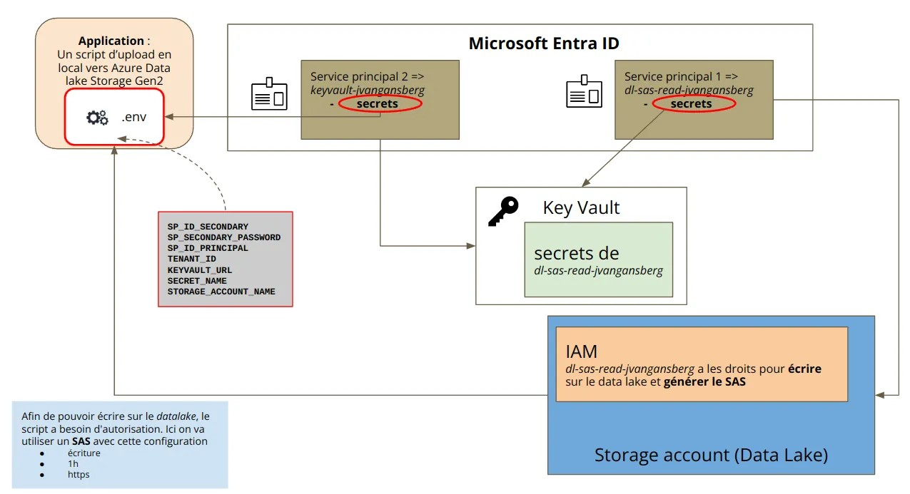

L’objectif de cette partie est de créer des scripts Python pour stocker des données dans un Azure Data Lake Storage Gen 2 de manière sécurisée. 

Nous allons gérer des identités et des secrets en utilisant des outils comme Azure Key Vault, tout en pratiquant les concepts de sécurité avec Azure.

